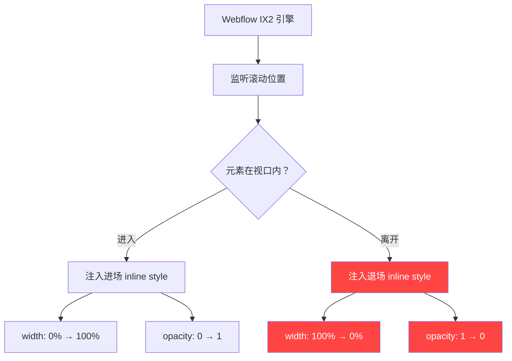
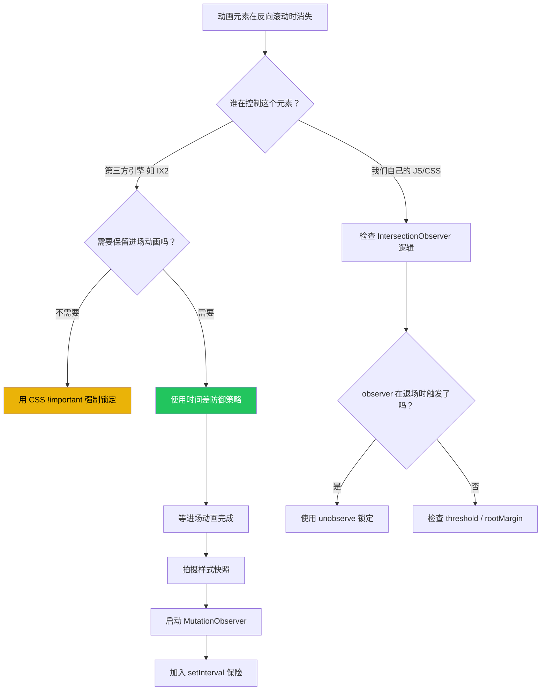

# 🔧 Webflow IX2 动画生命周期 Bug 修复全记录

> **项目**: WILL. 个人量化网站  
> **时间跨度**: 2026-04-06 ~ 2026-04-07  
> **难度评级**: ★★★★☆（多模型协作、跨引擎冲突）  
> **最终状态**: ✅ 已解决

---

## 一、Bug 描述

在 Tech Stack（技能卡片）板块中，当用户**向上滚动**（反向滚动）使板块离开视口后再次回到该板块时：

- ❌ 红色 SVG 图标消失
- ❌ 水平边框线条（`.value-item__line`）消失
- ❌ 竖线分隔符（`.value-divider`）消失
- ❌ h4 小标题（Python, C++, Network & Deploy, Git & LaTeX）消失
- ✅ 描述小字（`.reveal-text-line`）始终正常显示 ← **唯一幸存者**

**核心矛盾**：小字是我们自己用 CSS class + IntersectionObserver 控制的，所以不受影响；但图标、线条、标题是 Webflow IX2 原生引擎控制的，它在元素离开视口时会强行注入 inline style 让它们消失。

---

## 二、根因分析：Webflow IX2 引擎的"黑箱操作"

### 2.1 什么是 Webflow IX2？

Webflow 导出的网站会附带一个交互引擎（IX2），它：
- 从外部 JS 文件加载（`webflow.3ea7fb2f.954f9e2fdac02c24.js`）
- 通过 `data-wf-page` / `data-wf-site` 属性关联交互数据
- **直接操作 DOM 元素的 inline style**（最高优先级）
- 监听滚动位置，在元素进入/离开视口时触发进场/退场动画

### 2.2 IX2 退场时做了什么？

通过浏览器实时 DOM 检查确认：

```
进场时: style="width: 100%; opacity: 1; transform: translateY(0px)"
退场时: style="width: 0%;  opacity: 0; transform: translateY(20px)"
```

| 元素 | IX2 注入的退场属性 | 效果 |
|------|-------------------|------|
| `.value-item__line` | `width: 0%` | 线条缩回消失 |
| `.value-icon` | `opacity: 0` | 图标淡出 |
| `.value-text h4` | 多种属性组合（未确定单一属性） | 标题消失 |
| `.value-divider` | `opacity: 0` | 竖线消失 |

> [!IMPORTANT]
> **关键发现**：IX2 对不同元素使用**不同的隐藏策略**。线条用 `width:0%`，图标用 `opacity:0`，h4 用的是未知属性组合。这就是为什么每次"修好一个又冒出另一个"。

### 2.3 为什么自定义的小字不受影响？

```
小字的控制链：
  IntersectionObserver → 添加 .scroll-reveal-inview 类 → CSS transition 触发
  
IX2 不认识 .scroll-reveal-inview，也不管 .reveal-text-line，
所以小字完全生活在 IX2 管辖之外。
```

---

## 三、修复历程：六次迭代

### 迭代 1：CSS `!important` 强制覆盖 ❌

```css
.value-item.scroll-reveal-inview .value-icon {
    opacity: 1 !important;
    visibility: visible !important;
    transform: none !important;
}
```

**结果**：部分有效，但遗漏了 `width` 属性。

**教训**：
> [!CAUTION]
> 不要假设你知道 IX2 用了哪些属性。必须通过浏览器实际检查每个元素的 inline style 变化。

---

### 迭代 2：补上 `width: 100% !important` ❌

```css
.value-item.scroll-reveal-inview .value-item__line {
    width: 100% !important;  /* 补上遗漏 */
}
```

**结果**：线条保住了，但**进场动画被杀死**。线条从一开始就是 100% 宽度，失去了"从零展开"的动效。

**教训**：
> [!CAUTION]
> CSS `!important` 是双刃剑——它会覆盖 IX2 的**退场**动画，但也会覆盖 IX2 的**进场**动画。因为进场动画也是从 `width: 0%` 过渡到 `100%` 的。

---

### 迭代 3：`observer.unobserve()` 锁定 + 移除退场逻辑 ❌

```javascript
if (entry.isIntersecting) {
    el.classList.add('scroll-reveal-inview');
    observer.unobserve(el);  // 永不移除类名
}
```

**结果**：我们自己的 CSS 类确实锁住了，但 IX2 引擎根本不关心我们的 CSS 类——它有自己独立的滚动监听。

**教训**：
> [!WARNING]
> `unobserve` 只能阻止**我们自己的** IntersectionObserver 反复触发。Webflow IX2 有自己的滚动监听系统，完全独立运作，不受我们 JS 控制。

---

### 迭代 4：MutationObserver 逐属性守护 ⚠️ 部分成功

```javascript
const styleGuard = new MutationObserver((mutations) => {
    mutations.forEach(m => {
        const s = m.target.style;
        if (s.opacity !== '1') s.setProperty('opacity', '1', 'important');
        if (s.width === '0%') s.setProperty('width', '100%', 'important');
        // ... 更多属性
    });
});
```

**结果**：
- ✅ 图标、边框线保住了
- ✅ 竖线分隔符保住了（`.value-divider` 加入保护范围后）
- ❌ h4 标题依然消失

**教训**：
> [!WARNING]
> 逐属性守护是在**猜谜**。你永远不知道 IX2 会用哪个属性来隐藏元素。对于 h4，我们猜了 `opacity`、`transform`、`clip-path`、`height`、`overflow`、`visibility`，**全部猜错**。

---

### 迭代 5：删除 CSS `!important` + 延迟 MutationObserver ⚠️ 部分成功

**核心思路**：进场动画需要 IX2 自由控制 → 不能用 `!important` 干扰 → 改为等动画完成后再启动防御。

```javascript
setTimeout(() => {
    // 3 秒后进场动画已完成，现在开始守护
    const snap = el.getAttribute('style');
    // 对 h4 使用"完整快照还原"而非逐属性检查
    if (isH4) {
        t.setAttribute('style', snap);  // 整体回滚
    }
}, 3000);
```

**结果**：仍然不够稳定。MutationObserver 只监听直接子元素，但 IX2 可能操作了更深层的 DOM 节点或通过 `requestAnimationFrame` 绕过了 Observer。

---

### 迭代 6（最终方案）：三重防御体系 ✅

```
┌──────────────────────────────────────────────┐
│         第一重：MutationObserver              │
│  subtree: true → 监控所有深层子元素           │
│  对 h4/.value-text 做完整快照还原             │
│  对其他元素做逐属性守护                       │
├──────────────────────────────────────────────┤
│         第二重：setInterval 巡检              │
│  每 500ms 主动检查 h4 样式是否被篡改          │
│  被篡改则立即回滚到快照                       │
├──────────────────────────────────────────────┤
│         第三重：3 秒延迟激活                  │
│  前 3 秒不干预 → 进场动画正常播放             │
│  3 秒后拍快照 → 启动防御                      │
└──────────────────────────────────────────────┘
```

**关键代码结构**：

```javascript
// 1. IntersectionObserver 触发首次入场
el.classList.add('scroll-reveal-inview');
observer.unobserve(el);

// 2. 延迟 3 秒等进场动画完成
setTimeout(() => {
    // 3. 收集所有保护目标（含动态创建的子元素）
    const allTargets = [el, ...el.querySelectorAll(
        '.value-item__line, .value-icon, .value-text, ' +
        '.value-text h4, .value-text .div-hide, .value-text div'
    )];
    
    // 4. 拍摄终态快照
    allTargets.forEach(child => {
        snapshots.set(child, child.getAttribute('style') || '');
    });
    
    // 5. MutationObserver（subtree: true）
    styleGuard.observe(el, {
        attributes: true,
        attributeFilter: ['style'],
        subtree: true  // ← 关键！捕获所有深度
    });
}, 3000);

// 6. setInterval 终极保险
setInterval(() => {
    h4Snapshots.forEach((snap, el) => {
        if (el.getAttribute('style') !== snap) {
            el.setAttribute('style', snap);
        }
    });
}, 500);
```

---

## 四、关键经验总结

### 4.1 Webflow IX2 的特性



> [!IMPORTANT]
> **IX2 的行为特征**：
> - 直接写入 inline style（最高 CSS 优先级）
> - 有自己独立的滚动监听（不受我们 JS 控制）
> - 对不同元素使用不同的隐藏属性
> - 可能通过 `requestAnimationFrame` 执行（绕过同步 MutationObserver）
> - 可能在运行时动态创建包裹元素

### 4.2 Vibe Coding 关键心法

#### 心法一：先诊断，后开药

```
❌ 错误流程：看到 bug → 猜原因 → 写代码 → 发现没修好 → 再猜...
✅ 正确流程：看到 bug → 浏览器实际检查 DOM 状态 → 确认具体属性 → 针对性修复
```

#### 心法二：不要与框架引擎对抗，要"顺势而为"

| 策略 | 描述 | 评价 |
|------|------|------|
| CSS `!important` | 硬性覆盖所有状态 | ❌ 杀敌一千自损八百（破坏进场动画） |
| 同步生命周期 | 让自定义元素跟随 IX2 一起消失 | ⚠️ 有效但不符合需求（用户要求不消失） |
| 时间差防御 | 先让 IX2 完成进场 → 再锁死状态 | ✅ 最优解 |

#### 心法三：防御要有纵深

```
单一防线 → 容易被绕过
多重防线 → 即使一层失效，其他层兜底

MutationObserver 可能被 rAF 绕过 → setInterval 兜底
逐属性检查可能遗漏属性 → 完整快照还原兜底
浅层监听可能漏掉子元素 → subtree: true 兜底
```

#### 心法四：快照还原 > 逐属性猜测

```
❌ 逐属性守护（需要知道对方用了什么属性）：
   if (s.opacity !== '1') → fix
   if (s.width === '0%') → fix
   if (s.transform !== 'none') → fix
   // 永远有漏网之鱼

✅ 快照还原（不需要知道对方做了什么）：
   const snap = el.getAttribute('style');  // 记住正确状态
   // ... 之后任何变化都回滚
   el.setAttribute('style', snap);  // 无脑还原
```

### 4.3 技术决策树



---

## 五、文件变更清单

| 文件 | 行号范围 | 变更内容 |
|------|---------|---------|
| `index.html` | ~226 | 删除 CSS `!important` 强制覆盖块 |
| `index.html` | ~1425-1520 | IntersectionObserver + MutationObserver + setInterval 三重防御 |
| `index.html` | ~255-285 | CSS `nth-child` 扩展到 20 行，delay 步进 0.1s |

---

## 六、后续注意事项

> [!WARNING]
> **不要在 Webflow 后台修改该板块的交互**  
> 任何对 Tech Stack 板块的 IX2 交互修改都可能改变退场行为，导致快照失效。如需修改，必须同步更新 JS 代码中的防御逻辑。

> [!TIP]
> **终极解决方案（如果有机会重构）**  
> 在 Webflow 后台彻底**删除** Tech Stack 板块的 IX2 退场交互，只保留进场交互。这样就不需要任何 JS 防御了。目前的三重防御是在"不动 Webflow 后台"前提下的最优工程妥协。

> [!NOTE]
> **性能影响评估**  
> - `setInterval(500ms)` 仅检查 ~8 个元素的 style 字符串比较，开销极低
> - `MutationObserver` 只在 IX2 实际修改 style 时触发，正常浏览时无额外开销
> - 整体对页面性能无可感知影响

---

## 七、适用场景与复用指南

此方案可复用于任何**第三方动画引擎通过 inline style 控制元素可见性**的场景：

1. Webflow IX2 退场动画
2. GSAP ScrollTrigger 的 `toggleActions` 退出效果
3. AOS（Animate On Scroll）的反向动画
4. 任何通过 DOM 操作注入 inline style 的第三方库

**复用模板**：
```javascript
function freezeAfterEntrance(container, delay = 3000) {
    const snapshots = new Map();
    setTimeout(() => {
        container.querySelectorAll('*').forEach(el => {
            snapshots.set(el, el.getAttribute('style') || '');
        });
        new MutationObserver(mutations => {
            mutations.forEach(m => {
                const snap = snapshots.get(m.target);
                if (snap !== undefined) {
                    const curr = m.target.getAttribute('style') || '';
                    if (curr !== snap) m.target.setAttribute('style', snap);
                }
            });
        }).observe(container, {
            attributes: true,
            attributeFilter: ['style'],
            subtree: true
        });
    }, delay);
}
```

---

*记录者：Antigravity AI × WILL. | 2026-04-07*
